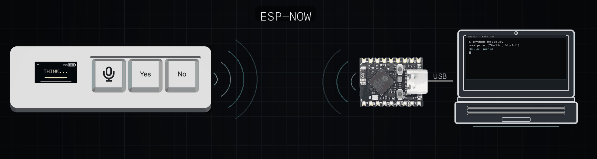

# 知言（Zhiyan）

手持端 + USB 接收端固件与配套工具。手持通过 **ESP-NOW（2.4G）** 把三键和语音送到接收端；电脑把接收端认成 **USB 键盘 + 麦克风 + CDC 串口**。



工程名曾用 Vibe / VibeKey。本仓库开源的是**软件与烧录说明**；完整 PCB/Gerber 见立创开源。

## 相关链接

| | 地址 |
|--|------|
| 立创开源（硬件） | https://oshwhub.com/runobj/project_amwzvrns |
| B 站演示 | https://www.bilibili.com/video/BV1dXat6pEEt |
| MakerWorld（结构件） | https://makerworld.com.cn/zh/models/3024819-zhi-yan-san-jian-yu-yin-jian-pan#profileId-3554418 |
| 键位配置网页 | https://agthuang.github.io/zhiyan/ |

---

## 仓库结构

```text
firmware/          # ESP-IDF 固件（手持 + 接收端 + 共用组件）
docs/flashing.md   # Mac / Windows 编译与烧录（从这里开始复刻）
docs/images/       # 架构示意图等
web/keymap/        # 浏览器改三键快捷键（Web Serial → 接收端 CDC）
aihook/            # 可选：把 Codex 等 AI 状态推到手持小屏
tools/             # 烧录 / 授时 / 起 keymap 服务等脚本
```

| 文档 | 内容 |
|------|------|
| **[`docs/flashing.md`](docs/flashing.md)** | 装 ESP-IDF、进下载模式、刷两端、配对、校时 |
| [`firmware/README.md`](firmware/README.md) | 固件目录、主机单测、CDC 命令速查 |
| [`web/keymap/README.md`](web/keymap/README.md) | 键位配置页怎么开 |
| [`aihook/README.md`](aihook/README.md) | AI Hook 安装与推屏 |

---

## 快速开始（烧录）

1. 安装 [ESP-IDF](https://docs.espressif.com/projects/esp-idf/en/latest/esp32s3/get-started/)（≥ 5.1，建议 5.3+），目标芯片 **ESP32-S3**。  
2. 按 **[`docs/flashing.md`](docs/flashing.md)** 依次编译烧录：
   - `firmware/handheld`（手持，Flash **4 / 8 / 16MB**，按模组选；`./tools/flash_handheld.sh` 可自动识别）
   - `firmware/receiver`（接收端，Flash **4MB**）  
3. 接收端插电脑 → 手持正常开机配对 → 对接收端 CDC 授时一次。

接收端若为 **ESP32-S3 SuperMini**：板载 WS2812（GPIO48）作状态灯——蓝闪=未连手持，绿=已连，琥珀=按住 Voice（蓝充电灯不可控）。

手持 Flash 细节见 [`docs/flashing.md`](docs/flashing.md) §4.0。摘要（详细步骤与 Windows `COMx` 见烧录文档）：

```bash
. $HOME/esp/esp-idf/export.sh          # Windows：用 ESP-IDF 终端

cd firmware/handheld
idf.py set-target esp32s3 && idf.py build
idf.py -p /dev/cu.usbmodemXXXX flash   # Windows 例：-p COM5

cd ../receiver
idf.py set-target esp32s3 && idf.py build
idf.py -p /dev/cu.usbmodemXXXX flash
```

烧录注意：

- 手持 **Voice = GPIO0 = BOOT**，进下载模式或复位时不要误按住 Voice。  
- 接收端用 **USB OTG** 枚举成设备；进下载模式一般为：按住 BOOT → 点 RESET → 松开 BOOT。

---

## 烧录后怎么确认

1. 系统出现 **Zhiyan Receiver**（键盘 + 麦克风；VID `0x303A` / PID `0x1003`）。  
2. 手持屏：`pair` → 配对成功后为空闲时钟。  
3. 授时（接收端 CDC，Mac 示例）：

```bash
printf 'T%s\n' "$(date +%s)" > /dev/cu.usbmodemXXXX
```

4. 按住 **Voice** 有麦；点 **Yes** / **No** 默认为 Enter / Backspace。  
5. 改快捷键：`cd web/keymap && python3 -m http.server 8766`，用 Chrome/Edge 打开 localhost 连接接收端。

更多配对锁定、`P!` / Yes+No 清配对、故障排查 → [`docs/flashing.md`](docs/flashing.md)。

---

## 固件规格（摘要）

| 项 | 说明 |
|----|------|
| 主控 | 两端均为 ESP32-S3；手持 Flash **4 / 8 / 16MB**（默认配置按 N8R2 的 8MB） |
| 无线 | ESP-NOW，信道 **1** |
| 语音 | 16 kHz / 16-bit / mono；按住 Voice 推流（PTT） |
| 接收端 USB | 键盘 + UAC 麦 + CDC；设备名 Zhiyan Receiver |
| 默认可选键 | Voice = Right-⌘+Right-Ctrl；Yes = Enter；No = Backspace（网页可改） |
| 蓝牙媒体（可选，**Beta**） | **先按住 Yes 再开机** ≥1.5s → 手机搜「知言」；Voice↑ / Yes Space / No↓。鸿蒙可用；苹果/安卓常需自行映射键位 |

共用逻辑在 `firmware/components/common/`（协议、UI、按键、HID 策略），可主机编译单测，见 [`firmware/README.md`](firmware/README.md)。

---

## 手持端 GPIO（Controller-RevB）

三键为低电平有效、内部上拉。

| 功能 | GPIO | 备注 |
|------|------|------|
| Voice / PTT | **IO0** | 兼 BOOT |
| Yes / Accept | **IO10** | 开机长按进蓝牙媒体（Beta） |
| No / Delete | **IO9** | |
| I²S BCLK / WS / SD | **IO12 / 14 / 13** | 麦 ICS-43434 |
| MIC_PWR_EN | **IO11** | 低电平使能 |
| LCD SPI（ST7735 0.96"） | SCLK **42** MOSI **41** CS **38** DC **39** RST **40** | 横屏 160×80 |
| BLK / DISP_PWR_EN | **IO2** / **IO1** | 背光 PWM；屏电源低有效 |
| BAT_SENSE | **IO3** | ADC，约 1M / 330k 分压 |
| CHG_DONE_N / CHG_STAT_N | **IO47** / **IO48** | 低有效 |

接收端无手持这套键/麦/屏脚；对电脑走片内 USB OTG。

**屏模组变体：** 不同厂家 80×160 ST7735 的 GRAM 偏移/反色常不一致。改 `firmware/handheld/main/board.h` 里的 `LCD_PANEL_VARIANT`（`0`=原配套 1/26+反色，`1`=常见另一款 0/24+不反色）后重烧。斜切花屏→偏移；发白→反色。同芯片 ID **无法可靠自动区分**，见 [`docs/flashing.md`](docs/flashing.md) 常见问题、[`firmware/README.md`](firmware/README.md)。

---

## 可选组件

- **键位网页** [在线打开](https://agthuang.github.io/zhiyan/)（源码 [`web/keymap/`](web/keymap/)）。用 Chrome / Edge，接收端插在打开网页的这台电脑上。改三键、背光、看状态。  
- **AI Hook** [`aihook/`](aihook/) — Codex 生命周期推 OSD 到手持（`O #RRGGBB WORD`）。  
- **tools/** — `flash_*.sh`（PlatformIO 可选路径）、`set_time.sh`、`serve_keymap.sh` 等。

---

## 许可

开源许可证文件若尚未放入本目录，发布前请自行补充 `LICENSE`（例如 MIT 或 Apache-2.0）。USB VID `0x303A` 为 Espressif 示例用法；量产请自行申请 PID。
